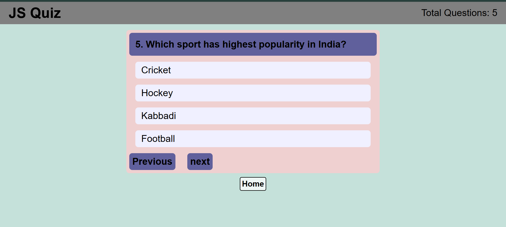

# Quiz App 📝

A simple quiz app built with vanilla JavaScript.
Answer multiple choice questions and see your final score.

---

## Features
- ❓ Multiple choice questions
- ✅ Highlights correct and wrong answers
- 📊 Tracks and displays final score
- 💾 Saves last score using localStorage
- 🔄 Score persists after page refresh

---

## Tech Used
- HTML
- CSS
- JavaScript (Vanilla)

---

## How to Run
1. Clone the repo
2. Open `index.html` in your browser

---

## Screenshot

---

## Live Demo
[Click Here](https://piyushdhakad001.github.io/js-quiz-app/)

---

Made by **Piyush** 🚀